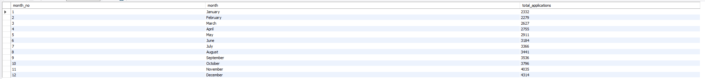
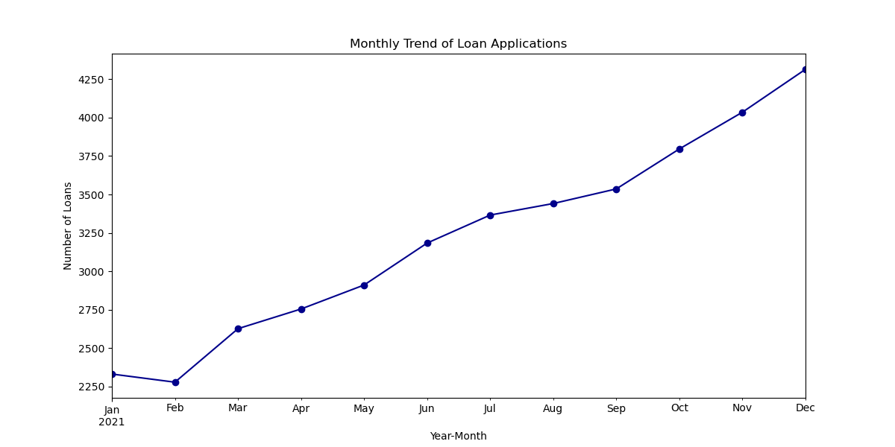
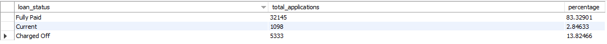
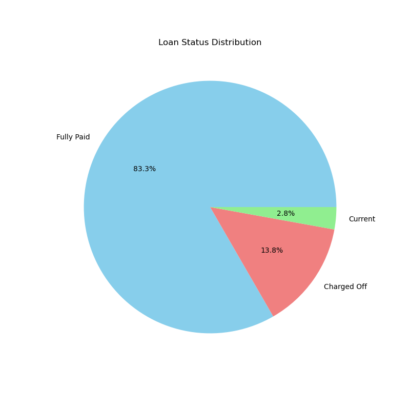
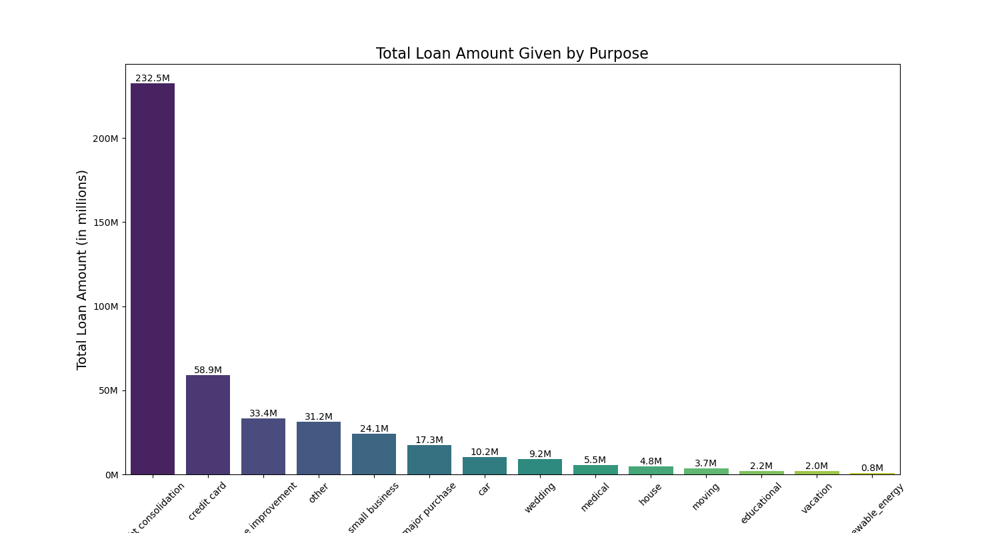
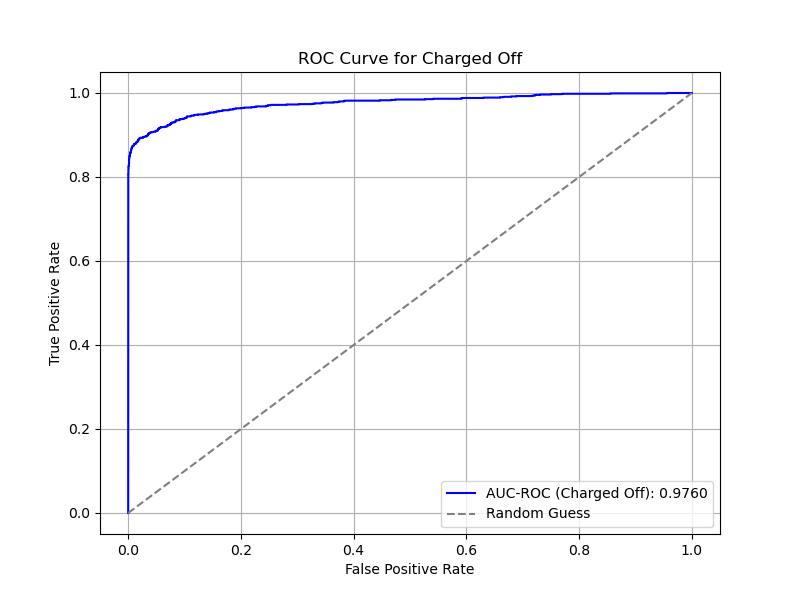

# **Bank Loan Risk Prediction**
# by Nabeel Ghalib


## Objective:
 
The main objective of this project was to design a database, perform data analysis, and build a predictive model to identify borrowers who are at risk of defaulting on their loans. 
The specific goals were:
1. Clean and preprocess the data.
2. Conduct descriptive analysis to uncover key patterns.
3. Build and evaluate a predictive model with high accuracy.

## Data used:

The data for this project was provided to me by the swapnajeet.

## Tools Used:

- **Jira**: Project management
- **MySQL:** Data preparation and Descriptive analysis
- **Jupyter Notebook:** Predictive Analysis (Model building, Evaluating and Tuning)

## Key Tasks and Approach:

### 1. Project Planning (Kanban Methodology):

Kanban workflow: Managed tasks using a Kanban board to track progress across phases:
- To Do: Data cleaning, analysis, feature engineering, and model building.
- In Progress: Current tasks prioritized by deadlines.
- Done: Completed milestones for project monitoring.
Set deadlines for each phase to ensure smooth execution and timely delivery.

### 2. Data Cleaning & Transformation (MySQL):

Identified and Handled Missing Values:
- The emp_title column had empty spaces (not NULL values) and whitespace characters.
- Used the TRIM function to remove unnecessary whitespace from the emp_title values.
- Converted empty strings and spaces into NULL values to ensure consistency.
- Replaced the NULL values in emp_title with the string 'Unknown' to handle missing data appropriately.
- Converted the columns with dates stored as text into date data type.

```sql

-- counting null, empty strings and white spaces --

SELECT 
    COUNT(*) AS total_rows,
    SUM(CASE WHEN emp_title IS NULL THEN 1 ELSE 0 END) AS null_values,
    SUM(CASE WHEN emp_title = '' THEN 1 ELSE 0 END) AS empty_strings,
    SUM(CASE WHEN TRIM(emp_title) = '' THEN 1 ELSE 0 END) AS whitespace_only
FROM loan_data;
```
- There were no null values just empty spaces and whitespaces.

```sql

-- updating the empty spaces with null and then to unknown --

UPDATE loan_data
SET emp_title = NULL
WHERE emp_title = '' OR TRIM(emp_title) = '';

update loan_data
Set emp_title = 'Unknown'
where emp_title is null;

```
- Converted the null to unknown instead leaving it as null because it was appropriate for the upcoming model building.

- Converting text values in date columns.

```sql

UPDATE loan_data
SET issue_date = STR_TO_DATE(issue_date, '%d-%m-%Y')
WHERE issue_date IS NOT NULL;

ALTER TABLE loan_data
MODIFY issue_date DATE;

```

### 3. Descriptive Analysis (MySQL):

In this project, I performed a comprehensive Descriptive Analysis of loan data, aiming to extract meaningful insights to support decision-making and performance tracking in the loan business. The analysis covers key performance indicators (KPIs) such as loan applications, funded amounts, received payments, and loan status.

Here are few Key insights:

**Loan Applications & Trends:**

```sql

select month(issue_date) as month_no,
monthname(issue_date) as month,
count(id) as total_applications
from loan_data
group by month
order by month;

```







**Insight:** 
- The total number of loan applications has steadily increased over time, indicating growing demand for loans.

**Actionable Insight:** 
- This upward trend suggests that the bank can plan for higher volumes of loan applications, adjusting resources and processing systems accordingly.


**Loan Status Distribution:**

``` sql

SELECT 
    loan_status,
    COUNT(id) AS total_applications,
    (COUNT(id) * 100.0 / (SELECT COUNT(id) FROM loan_data)) AS percentage
FROM loan_data
GROUP BY loan_status;

```








**Insights:** 
- The majority of loans (83.3%) have been fully paid, indicating that most borrowers are able to repay their loans successfully.
- A relatively smaller portion (13.8%) of loans has been charged off, indicating some level of loan defaults.
- Only 2.8% of loans are currently active and unpaid, suggesting effective loan management.

**Actionable Insights:**
- This high repayment rate suggests that the bank can continue offering loans with confidence. However, it may consider implementing targeted marketing strategies to further incentivize borrowers and maintain this trend.
- The bank should focus on enhancing its risk management strategies, such as improving credit assessments and collection processes, to reduce charge-offs and mitigate potential losses.
- The bank could maintain its current operational processes and focus on maintaining low levels of unpaid loans, while exploring ways to further streamline collections or recovery on these loans.


**Loan Amount Funded by Purpose:**





**Insights:**

**Top 5 Loan Categories:**

- **Debt Consolidation (232.5M):** The largest category, reflecting efforts to consolidate debt for simpler repayment terms or lower interest rates.
- **Credit Card (58.9M):** A significant portion of loans is directed towards credit card debt, indicating people are managing high-interest balances.
- **Home Improvement (33.4M):** Strong investment in home renovations, likely driven by rising home values or market trends.
- **Other (31.2M):** Miscellaneous loans for unspecified purposes, representing a range of financial needs.
- **Small Business (24.1M):** Loans for small businesses, likely indicating growth or support during recovery from economic challenges.

**Bottom 3 Loan Categories:**

- **Renewable Energy (0.8M):** Low investment, suggesting potential for growth in renewable energy loans given the global push for sustainability.
- **Vacation (2.0M):** Low demand for vacation loans, likely due to travel restrictions or reduced discretionary spending.
- **Educational (2.2M):** Limited amount for educational loans, possibly due to alternative funding options or rising education costs discouraging borrowing.


**4. Predictive Modeling:**

**Data Preprocessing:**

- Null values were already handled in MySQL, and there were no other errors, format inconsistencies, or dirty data.
- Identified Outliers and them left as they were because these models are robust to them.
- Converted the categorical variables into numerics by one hot encoding, label encoding.
- Since Random Forest and XGBoost models are not sensitive to feature scaling, normalizing numerical variables was not necessary.

**Model Selection:**

- Random Forest and XGBoost models were selected due to their effectiveness in handling tabular data and their ability to provide high accuracy.

**Model Training:** 

- Both models were trained using the preprocessed data, with hyperparameters tuned to optimize performance.

**Feauture Selection:**

- Selected important features using the important feature plot of XGB.

**Evaluation:** 

The XGBoost model was evaluated using accuracy, precision, recall, F1-score, the confusion matrix, and AUC-ROC score.

**Confusion Matrix:**

- **True Positives (TP):** 6359 (Correctly predicted fully paid loans)
- **False Positives (FP):** 144 (Charged-off loans incorrectly predicted as fully paid)
- **True Negatives (TN):** 952 (Correctly predicted charged-off loans)
- **False Negatives (FN):** 41 (Fully paid loans incorrectly predicted as charged-off)

- The confusion matrix shows a low number of false negatives (41) and false positives (144), indicating good performance in distinguishing between fully paid and charged-off loans.

**Classification Report:**

- **Precision for Fully Paid Loans (Class 1):** 0.98 – The model's accuracy in predicting fully paid loans.
- **Recall for Fully Paid Loans (Class 1):** 0.99 – The model successfully identifies most fully paid loans.
- **Precision for Charged-Off Loans (Class 0):** 0.96 – The model's accuracy in predicting charged-off loans.
- **Recall for Charged-Off Loans (Class 0):** 0.87 – The model identifies a high percentage of charged-off loans.
- **F1-score for Fully Paid Loans (Class 1):** 0.99 – The model's balance between precision and recall for fully paid loans.
- **F1-score for Charged-Off Loans (Class 0):** 0.91 – The model's balance between precision and recall for charged-off loans.

- The overall macro average F1-score is 0.95, and the weighted average F1-score is 0.97, demonstrating strong performance across both classes.

**AUC-ROC Score:**

- The AUC-ROC score for predicting charged-off loans (Class 0) is 0.9760, indicating excellent model performance with a high true positive rate and low false positive rate for classifying charged-off loans.

**ROC Curve Analysis:**

To further assess the model’s performance, I plotted the ROC Curve for both Fully Paid loans (Class 1) and Charged-Off loans (Class 0). The ROC curve shows the model's ability to distinguish between these two classes across different thresholds.



- **Fully Paid Loans (Class 1):** The ROC curve for Class 1 shows a high true positive rate, indicating that the model is excellent at identifying fully paid loans.
- **Charged-Off Loans (Class 0):** The ROC curve for Class 0 demonstrates a similarly high true positive rate and low false positive rate, confirming the model's effectiveness at identifying charged-off loans.

**Overall Performance:**

- The final XGBoost model achieved a **97.53%** accuracy score, demonstrating its effectiveness in predicting loan risk.
- The AUC-ROC score, along with the precision, recall, and F1-scores, shows the model’s robustness in distinguishing between fully paid and charged-off loans.
 


## 5. Conclusion:

In this project, I aimed to predict loan defaults and assess the effectiveness of predictive models in distinguishing between fully paid loans and charged-off loans. The XGBoost model demonstrated remarkable performance with an accuracy of **97.53%** and an AUC-ROC score of **0.9760**, which indicates the model’s ability to distinguish between the two classes with high confidence.

**Key insights from the evaluation include:**

- **Precision and Recall:** The model showed strong precision and recall scores for both classes (fully paid loans and charged-off loans), with the highest values for fully paid loans (Class 1). This suggests that the model effectively identifies borrowers who will fully repay their loans, while also accurately flagging those who may default.
- **F1-scores:** The high F1-scores for both classes (0.99 for fully paid loans and 0.91 for charged-off loans) indicate a good balance between precision and recall, ensuring that the model does not over-predict one class at the cost of the other.
- **Confusion Matrix:** The low number of false positives and false negatives suggests that the model performs well in distinguishing between the two loan statuses, making it a reliable tool for loan risk prediction.


