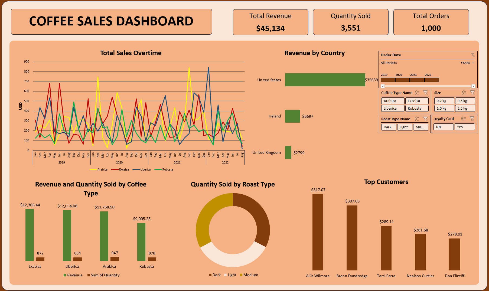

# Coffee Shop Sales Analysis & Reporting  

## Objective  
This project analyzes sales data from a coffee shop to identify trends, customer preferences, and business insights using Pivot Tables, Pivot Charts and buliding a interactive dashboard in Excel.  

---

## Tools & Techniques Used  

### Data Consolidation & Cleaning  
- **XLOOKUP, INDEX-MATCH:** Merged and consolidated order details from different sheets into a structured Orders Sheet.  
- **Data Cleaning:** Removed duplicates, handled missing values, and standardized formats.  

### Analysis & Visualization  
- **Pivot Tables:** Summarized total sales, revenue, and customer behavior.  
- **Pivot Charts & Dashboard:** Created interactive visualizations for key insights.  
- **Calculated Fields:** Used custom calculations for revenue trends and customer segmentation.  

---

## Key Insights  

### Overall Sales Performance  
- Total Revenue: **$45,134**  
- Total Quantity Sold: **3,551 units**  
- Total Orders: **1,000**  

### Monthly Sales Trends  
| Month  | Revenue ($) |
|--------|------------|
| January  | 3,503 |
| February | 4,138 |
| March    | 4,796 |
| April    | 4,225 |
| May      | 3,248 |
| June     | 4,843 |
| July     | 3,983 |
| August   | 2,327 |
| September | 3,634 |
| October  | 3,800 |
| November | 3,548 |
| December | 3,090 |

- Best Month: **June ($4,843)**  
- Lowest Month: **August ($2,327)**  

### Country-Wise Sales  
| Country | Revenue ($) |
|---------|------------|
| United States | 35,639 |
| Ireland | 6,697 |
| United Kingdom | 2,799 |

- The **United States contributes 79% of total sales**. This suggests a strong market presence and an opportunity to further expand.  

### Customer Purchase Behavior  
- Top Buyer (by Quantity): **Terri Farra (22 units)**  
- Top Buyer (by Revenue): **Allis Wilmore ($317.07)**  

### Impact of Loyalty Cards on Sales  
| Loyalty Card Holder | Revenue ($) | Quantity Sold |
|---------------------|------------|--------------|
| No                 | 24,216.41   | 1,886        |
| Yes                | 20,917.85   | 1,665        |

- **Non-loyalty card customers generate higher revenue ($24,216)**, but loyalty cardholders have a strong base.  
- A well-structured **loyalty rewards program** could encourage repeat purchases and improve retention. 

### Coffee Product Performance  
| Coffee Type | Revenue ($) | Quantity Sold |
|------------|------------|--------------|
| Excelsa | 12,306.44 | 872 |
| Liberica | 12,054.08 | 854 |
| Arabica | 11,768.50 | 947 |
| Robusta | 9,005.25 | 878 |

- Best-selling coffee by revenue: **Excelsa & Liberica**  
- Most popular coffee (units sold): **Arabica**  

### Package Size Performance  
| Package Size | Quantity Sold |
|-------------|--------------|
| 0.2 kg | 892 |
| 0.5 kg | 943 |
| 1.0 kg | 875 |
| 2.5 kg | 841 |

- **Smaller packages (0.5 kg)** sell the most. This indicates a preference for smaller quantities, but promotions on larger packs may increase bulk purchases.  

### Roast Type Preference  
| Roast Type | Quantity Sold |
|-----------|--------------|
| Light | 1,230 |
| Medium | 1,165 |
| Dark | 1,156 |

- **Light Roast** is the most preferred roast type.  

---

## Excel Dashboard  

An **interactive dashboard** was built in Excel using:  
✔ Pivot Charts for **trend analysis** and **sales comparison**  
✔ Slicers for **dynamic filtering** by **month, year, and coffee type**  
 

**Dashboard Features:**  
- A summary of total sales, orders, and revenue  
- Seasonality sales trend visualization  
- Customer segmentation analysis  
- Product performance breakdown by revenue and quantity
- Country wise revenue  

 ---

## Recommendations  

1. Increase inventory for high-selling months (March & June) to prevent stockouts.  
2. Boost marketing efforts in the United States since it accounts for 79% of revenue.  
3. Loyalty Programs:
      - Convert non-loyalty customers into loyalty members by offering incentives such as first-time discounts, exclusive deals, or early access to new products.
      - Enhance the loyalty program by introducing tier-based rewards, where higher spending unlocks better discounts, encouraging repeat purchases  
4. Promote larger coffee packs (1.0 kg & 2.5 kg) to increase bulk purchases.  
5. Stock more Light Roast coffee as it is the most preferred type.  

---

## Conclusion  
This Coffee Shop Sales Analysis provided valuable insights into sales trends, customer preferences, and product performance. By implementing these strategies, the coffee shop can increase revenue, optimize inventory, and enhance customer satisfaction.  

---

Excel Workbook -> [Excel workbook](coffee_sales_analysis.xlsx)
