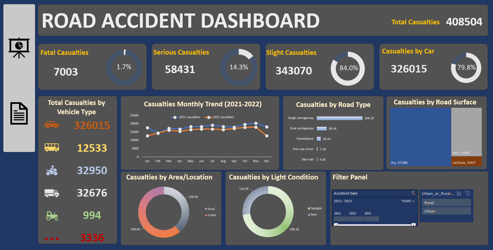

# Road Accident Analysis & Dashboard

## Overview
This project analyzes road accident casualties using Excel, leveraging Pivot Tables, Pivot Charts, and an Interactive Dashboard. The goal is to identify key trends based on severity, road conditions, vehicle types, and other contributing factors to improve road safety.

## Tools & Techniques Used
- Excel (Data Cleaning, Pivot Tables, Pivot Charts)
- Interactive Dashboard (Navigation between analysis and dashboard)
- Data Cleaning & Transformation
- Text Functions (Extracted Month & Year from Date for trend analysis)

## Data Cleaning & Transformation
To ensure accurate analysis, the dataset underwent cleaning and transformation:

- Handled missing values in key columns to maintain data integrity.
- Extracted Month & Year from the date field using text functions.

## Key Insights

### Casualty Severity
- Slight injuries account for the majority of accidents.
- Fatal and serious accidents, though fewer, have significant consequences.

### Casualties by Vehicle Type
- Cars have the highest accident involvement, followed by bikes and vans.
- Agricultural vehicles contribute the least to accident numbers.

### Monthly Trends (2021 & 2022)
- Accidents peak in winter months (December – February), likely due to adverse weather conditions.
- Lower casualty rates in summer (June – August) suggest better road conditions and visibility.

### Road Type & Surface Conditions
- Dual carriageways have the highest accident numbers, followed by single carriageways.
- Slip roads and one-way streets report the lowest casualty figures.
- Dry roads see the most accidents, while ice/snow conditions have the least.

### Urban vs. Rural Areas
- Urban areas have a higher accident frequency, likely due to traffic congestion.
- Rural areas, though fewer in number, may have more severe accidents due to high speeds and limited emergency response.

### Light Conditions
- Most accidents occur in daylight, likely due to higher traffic volume during work hours.
- Nighttime accidents are fewer but potentially more severe due to reduced visibility.

## Recommendations
- Improve Road Safety Measures: Enhance road signage, reflectors, and street lighting, especially in high-risk rural areas.
- Winter Road Maintenance: Strengthen road maintenance during peak winter months to prevent weather-related accidents.
- Speed Control & Enforcement: Deploy speed cameras in rural and high-risk zones to reduce speeding-related casualties.
- Traffic Awareness Campaigns: Educate drivers about high-risk accident zones and road safety best practices.
- Encourage Public Transport Use: Reducing private vehicle dependency in urban areas can ease congestion and lower accident rates.

## Interactive Dashboard & Navigation

- Pivot Tables & Charts summarize key findings dynamically.
- Interactivity Features
The dashboard includes a Filter Panel that allows users to dynamically filter data based on:
 - Year, Month, and Day
 - Urban and Rural Locations
- This enables users to explore trends and insights more efficiently by selecting specific filters.
- Added Dashboard and Data Analysis sheet icons and linked them to respective sheets.Navigation Buttons allow easy movement between the Dashboard and Data Analysis Sheet.
  

## Conclusion
This analysis provides critical insights into accident patterns, highlighting high-risk areas, seasonal trends, and key contributing factors. The interactive dashboard enhances data exploration and supports evidence-based road safety improvements. Implementing the recommendations can help reduce accident rates and improve overall road safety.
