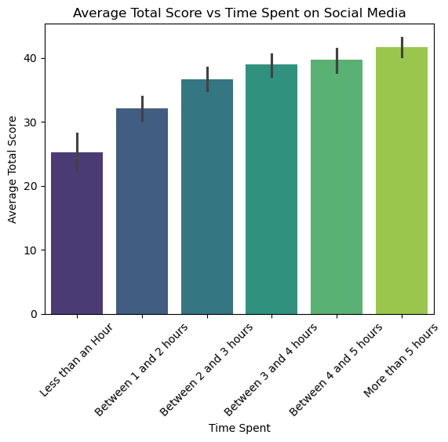
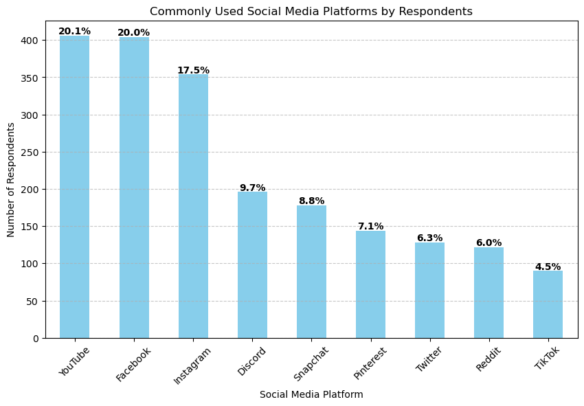
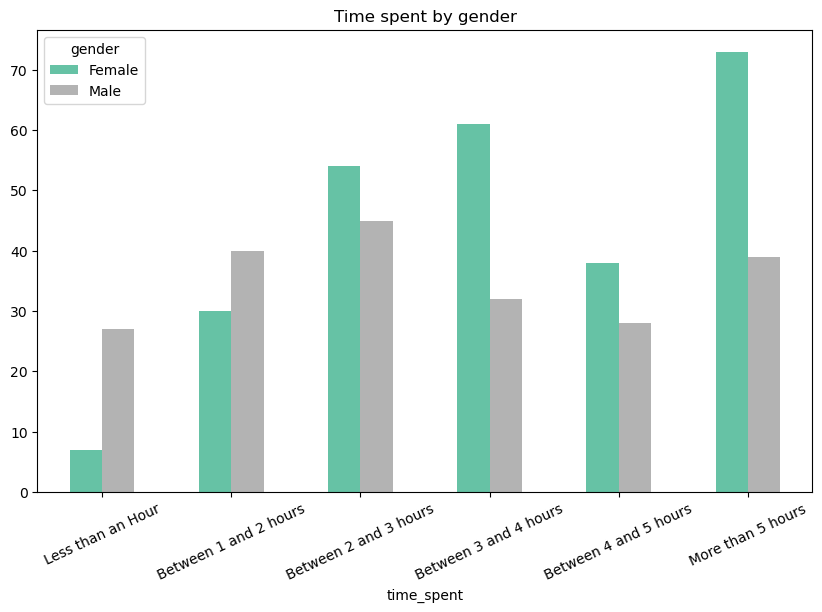
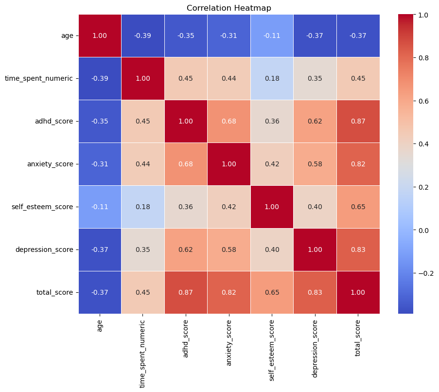

# Social Media & Mental Health Analysis

# by Nabeel Ghalib

## Project Overview  
This project explores the impact of social media usage on mental health and builds a predictive model to determine whether a user may need a mental health check-up based on their behavior and responses.

## Dataset  
**Source**: [Kaggle - Social Media & Mental Health](https://www.kaggle.com/datasets/souvikahmed071/social-media-and-mental-health). 

The dataset contains mental health scores (e.g., ADHD, depression, self-esteem), social media usage data, demographic information, and more.

## Tools & Libraries  
- Python  
- pandas, NumPy (Data Cleaning & Processing)  
- matplotlib, seaborn (Visualization)  
- scikit-learn (Machine Learning & Model Evaluation)  
- SciPy (Hypothesis Testing)

---

## Data Preprocessing

- **Data Cleaning & Transformation**:
    - **Mental Health Scores**: Combined ADHD, depression, self-esteem, and related factors into a single total score.
    - **Column Renaming**: Standardized column names for consistency across the dataset to ensure that the analysis is uniform.
            
    ```python
    # Renaming columns for consistency
    df = df.rename(
        columns = {
            '1. What is your age?':'age',
            '2. Gender':'gender',
            '3. Relationship Status':'relationship_status', 
            '4. Occupation Status':'occupation',
            '5. What type of organizations are you affiliated with?':'affiliations',
            '6. Do you use social media?':'social_media_user',
            '7. What social media platforms do you commonly use?':'platforms_used',
            '8. What is the average time you spend on social media every day?':'time_spent',
            '9. How often do you find yourself using Social media without a specific purpose?':'adhd_1',
            '10. How often do you get distracted by Social media when you are busy doing something?':'adhd_2',
            "11. Do you feel restless if you haven't used Social media in a while?":'anxiety_1',
            '12. On a scale of 1 to 5, how easily distracted are you?':'adhd_3',
            '13. On a scale of 1 to 5, how much are you bothered by worries?':'anxiety_2',
            '14. Do you find it difficult to concentrate on things?':'adhd_4',
            '15. On a scale of 1-5, how often do you compare yourself to other successful people through the use of social media?':'self_esteem_1',
            '16. Following the previous question, how do you feel about these comparisons, generally speaking?':'self_esteem_2',
            '17. How often do you look to seek validation from features of social media?':'self_esteem_3',
            '18. How often do you feel depressed or down?':'depression_1',
            '19. On a scale of 1 to 5, how frequently does your interest in daily activities fluctuate?':'depression_2',
            '20. On a scale of 1 to 5, how often do you face issues regarding sleep?':'depression_3'
        }
    )
    ```

- **Gender Aggregation**: Merged non-binary and similar categories into "Other", creating three categories: Male, Female, and Other for consistency in the gender-related data.
- **Fixed Inconsistencies & Missing Values**: Used `pandas` to identify and address missing data or incorrect entries across multiple columns, ensuring that the data was clean for analysis.

---

## Exploratory Data Analysis (EDA)

- **Time Spent on Social Media vs. Mental Health**:
Explored how time spent on social media significantly affects mental health scores. This was done by grouping the data by time spent and analyzing the distribution of mental health scores across these groups.

    ```python
    # Analyzing time spent on social media and its effect on mental health scores
    sns.barplot(data=df, x='time_spent', y='total_score', palette='viridis')
    plt.title('Average Total Score vs Time Spent on Social Media')
    plt.xlabel('Time Spent')
    plt.ylabel('Average Total Score')
    plt.xticks(rotation=45)
    plt.show()
    ```



- **Users ratio by Platform**:

    ```python
    # Platforms used ratio
    social_media_platforms = df['platforms_used'].str.split(', ', expand=True).stack().value_counts()
    
    # Calculate percentages
    total_responses = social_media_platforms.sum()
    percentages = (social_media_platforms / total_responses) * 100
    
    # Plot bar chart with counts on Y-axis
    plt.figure(figsize=(10, 6))
    bars = social_media_platforms.plot(kind='bar', color='skyblue')
    
    # Annotate bars with percentage values
    for index, value in enumerate(social_media_platforms):
        plt.text(index, value + 2, f'{percentages.iloc[index]:.1f}%', ha='center', fontsize=10, fontweight='bold')
    
    # Customizing the plot
    plt.title('Commonly Used Social Media Platforms by Respondents')
    plt.xlabel('Social Media Platform')
    plt.ylabel('Number of Respondents')
    plt.xticks(rotation=45)
    plt.grid(axis='y', linestyle='--', alpha=0.7)
    
    plt.show()
    ```


- **Time Spent on Social Media by Gender**:
    
    ```python
    time_spent_order = [
    "Less than an Hour",
    "Between 1 and 2 hours",
    "Between 2 and 3 hours",
    "Between 3 and 4 hours",
    "Between 4 and 5 hours",
    "More than 5 hours"
    ]
    
    df['time_spent'] = pd.Categorical(df['time_spent'], categories=time_spent_order, ordered=True)
    
    time_spent_gender = df.groupby(['time_spent','gender']).size().unstack()
    
    time_spent_gender.plot(kind = 'bar', figsize= (10,6), colormap= 'Set2')
    plt.title('Time spent by gender')
    plt.xticks(rotation = 25)
    plt.show()
    ```
  



- **Correlation Analysis**:
Conducted a correlation analysis to explore relationships between variables such as age, time spent on social media, and total mental health score.
  
    ```python  
    # Pre process
    time_spent_ord = {
    "Less than an Hour": 0,
    "Between 1 and 2 hours": 1,
    "Between 2 and 3 hours": 2,
    "Between 3 and 4 hours": 3,
    "Between 4 and 5 hours": 4,
    "More than 5 hours": 5
    }
    
    df['time_spent_numeric'] = df['time_spent'].map(time_spent_ord)
    df['time_spent_numeric'] = df['time_spent_numeric'].astype(int)
    
    correlation_matrix = df[['age', 'time_spent_numeric', 'adhd_score', 'anxiety_score', 'self_esteem_score', 'depression_score', 'total_score']].corr()
    
    # Correlation heatmap to find relationships between variables
    plt.figure(figsize=(10, 8))
    sns.heatmap(correlation_matrix, annot=True, cmap='coolwarm', fmt='.2f', linewidths=0.5)
    plt.title('Correlation Heatmap')
    plt.show()
    ```


---

## Hypothesis Testing

- **ANOVA Hypothesis Test**:  
    A one-way ANOVA test was conducted to check if there is a significant difference in mental health scores based on the time spent on social media.

    - **Null Hypothesis (H₀)**: Time spent on social media does not affect mental health.  
    - **Alternative Hypothesis (H₁)**: Time spent on social media affects mental health.

     ```python
    from scipy import stats
    
    # Perform ANOVA
    anova_result = stats.f_oneway(
        df[df['time_spent'] == 'Less than an Hour']['total_score'],
        df[df['time_spent'] == 'Between 1 and 2 hours']['total_score'],
        df[df['time_spent'] == 'Between 2 and 3 hours']['total_score'],
        df[df['time_spent'] == 'Between 3 and 4 hours']['total_score'],
        df[df['time_spent'] == 'Between 4 and 5 hours']['total_score'],
        df[df['time_spent'] == 'More than 5 hours']['total_score']
    )
    
    # Check p-value
    print("p-value:", anova_result.pvalue)
    
    # Interpretation of p-value
    if anova_result.pvalue < 0.05:
        print("Reject the null hypothesis: Time spent on social media affects mental health scores.")
    else:
        print("Fail to reject the null hypothesis: Time spent on social media does not affect mental health scores.")
    ```

**Result**: p-value: 2.9612663424811784e-25. 

The null hypothesis was rejected, confirming that social media time has a significant effect on mental health.

---

## Predictive Modeling

- **Logistic Regression**:  
    Used Logistic Regression to classify whether a user may need mental health support based on their social media behavior and mental health scores.

- **Data Preparation**:  
- One-Hot Encoding: Encoded categorical variables such as Gender , occupation etc.. to make them suitable for machine learning algorithms.
- Normalization: Scaled numerical variables (e.g., mental health score) for better model performance.
- Train-Test Split: Divided the dataset into training (70%) and testing (30%) sets.

    ```python
    # One-Hot Encoding  for categorical columns
    
    df_log = pd.get_dummies(df, columns=['gender', 'relationship_status', 'occupation'], drop_first=True)

    # Feature scaling
    numerical_columns = ['age', 'time_spent_numeric', 'adhd_score', 'anxiety_score', 'self_esteem_score', 'depression_score']
    
    from sklearn.preprocessing import StandardScaler
    scaler = StandardScaler()
    X[numerical_columns] = scaler.fit_transform(X[numerical_columns])

    # Train-Test Split
    
    from sklearn.model_selection import train_test_split
    X = df_log.drop('health_check_needed', axis = 1)
    y = df_log['health_check_needed']

    X_train, X_test, y_train, y_test = train_test_split(X, y , test_size= 0.3, random_state = 25)
    ```

- **Model Training & Evaluation**:
Trained a Logistic Regression model with 50-fold Cross-Validation and evaluated its performance using accuracy.

     ```python   
    from sklearn.model_selection import cross_val_score
    from sklearn.linear_model import LogisticRegression
    from sklearn.preprocessing import StandardScaler
    
    # Assuming X and y are already defined and the data has been preprocessed
    
    # Standardize the features
    scaler = StandardScaler()
    X[numerical_columns] = scaler.fit_transform(X[numerical_columns])  # Scaling the features
    
    # Initialize Logistic Regression Model
    
    model = LogisticRegression(max_iter=500, solver='liblinear')
    
    # Perform cross-validation (using 5 folds as an example)
    cv_scores = cross_val_score(model, X, y, cv=50, scoring='accuracy')
    
    # Print the cross-validation scores and their mean
    print("Cross-validation scores: ", cv_scores)
    print("Mean accuracy from cross-validation: ", np.mean(cv_scores))
    ```

**Results**:
- Mean Accuracy: 98.5%.
- The model demonstrated strong predictive power, accurately classifying users who may need mental health support.
    
---

## Results & Insights

- **Social media usage significantly impacts mental health**, Time spent on social media is a strong predictor of mental health risk.

- **Logistic Regression achieved 98.5% accuracy**, demonstrating the model’s ability to predict whether a user may need a mental health check-up based on their social media usage.

- **Statistical tests**, including ANOVA and correlation analysis, confirmed that social media habits have a measurable impact on mental health.
