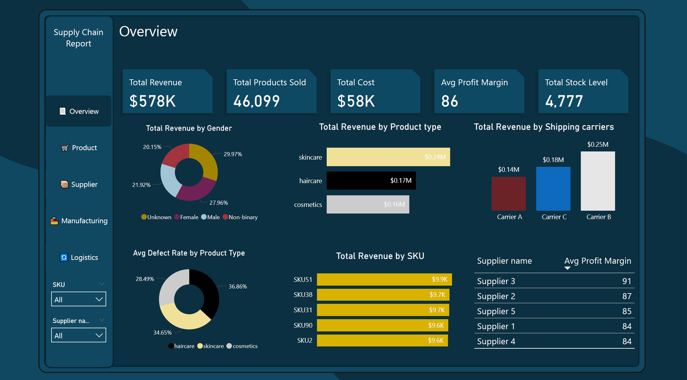
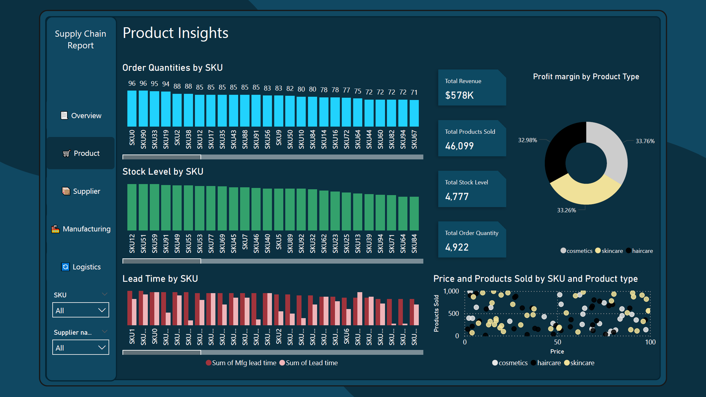
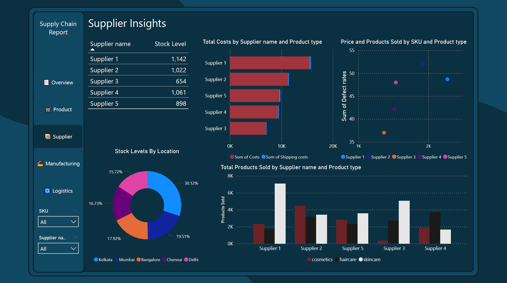
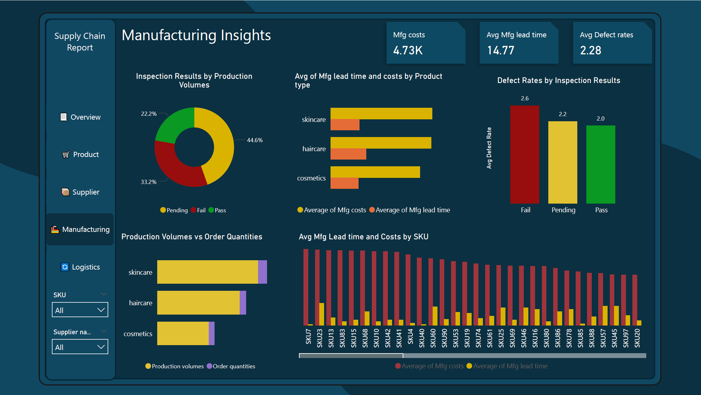
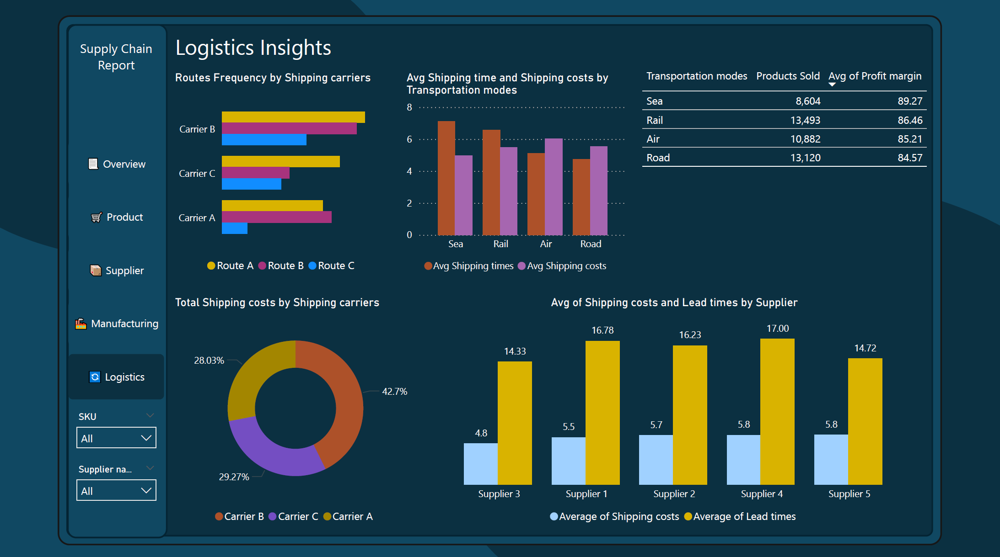

# Supply Chain Data Management and Reporting

## Overview
This project analyzes supply chain data to identify inefficiencies, optimize inventory management, and improve operational performance. The analysis was conducted using MySQL for data processing and exploratory analysis, followed by Power BI for data transformation, visualization, and insight generation.

**SQL Queries ->** [Queries](supply_chain_queries.sql) 

**Power Bi Dashboard ->** [Dashboard pbix](supply_chain.pbix), [Dashboard pdf](supply_chain_dashboard.pdf))

## Tools & Technologies Used
- **Database Management & Analysis:** MySQL
- **Data Transformation & Modeling:** Power Query in Power BI
- **Calculated Columns & Metrics:** DAX Measures in Power BI
- **Data Visualization & Reporting:** Power BI Dashboards

## Key Insights & Findings

### Sales & Demand Trends

- Total Revenue: $578K with 46,099 products sold.

**Top-Selling Product Types:**
- Skincare: $0.24M revenue
- Haircare: $0.17M revenue
- Cosmetics: $0.16M revenue
- High-Demand SKUs: SKU51, SKU38, SKU31, SKU90, and SKU2 generate the most revenue.

### Inventory & Stock Management

- Total Stock Level: 4,777 units.
- Stock Distribution: Kolkata (30.12%) holds the most inventory, followed by Mumbai and Bangalore.
- Stock Imbalance: Some SKUs have excessive stock, while certain fast-moving products frequently go out of stock.

### Supplier Performance

- Top Supplier by Profit Margin: Supplier 3 (91%), followed by Supplier 2 (87%) and Supplier 5 (85%).
- High-Cost Suppliers: Supplier 2 and Supplier 4 have higher procurement costs.

**Defect Rate Issues:**
- Haircare has the highest defect rate (36.86%), followed by Skincare (34.65%) and Cosmetics (28.49%).
- Defect rates were calculated using DAX measures in Power BI.

### Manufacturing Efficiency & Quality Control

- Average Manufacturing Lead Time: 14.77 days.
- Inspection Delays: 44.6% of products are still pending inspection, increasing supply chain bottlenecks.
- Product Failures: 33.2% of inspected products failed quality checks, impacting customer satisfaction.

### Logistics & Shipping Performance

**Total Shipping Cost Distribution:**
- Carrier B (42.7%) incurs the highest shipping cost.
- Sea Freight: Highest profit margin (89.27%) but slowest delivery.

**Shipping Efficiency:**
- Air shipping is the fastest but has the highest costs, making it less cost-effective for large shipments.
- Rail and Road transport provide a balanced trade-off between cost and efficiency, making them more suitable for mid-range deliveries.
- Balancing rail and road transport can optimize costs without affecting delivery speed.

## Actionable Insights & Recommendations
### Optimize Inventory Management

- Reallocate excess stock from Kolkata & Mumbai to demand-heavy regions.
- Implement real-time stock tracking to prevent frequent stockouts of high-demand SKUs.

### Enhance Supplier Performance

- Establish a supplier performance tracking system with stricter quality control.
- Diversify supplier base to mitigate risks of delays and high costs.

### Improve Manufacturing Efficiency

- Reduce pending inspections by streamlining quality control processes.
- Lower defect rates by improving haircare and skincare product quality.
- Optimize manufacturing lead times to improve supply chain agility.

### Optimize Logistics & Shipping

- Shift more shipments to rail & road to reduce costs while maintaining efficiency.
- Negotiate better contracts with Carrier B to lower high shipping expenses.
- Implement route optimization for faster deliveries and cost savings.

## Conclusion
This analysis identified key inefficiencies in the supply chain, including inventory imbalances, supplier performance issues, and logistics inefficiencies. The actionable recommendations focus on optimizing stock management, improving supplier relations, and enhancing shipping efficiency. By implementing these strategies, businesses can reduce costs, improve operational performance, and boost customer satisfaction.
